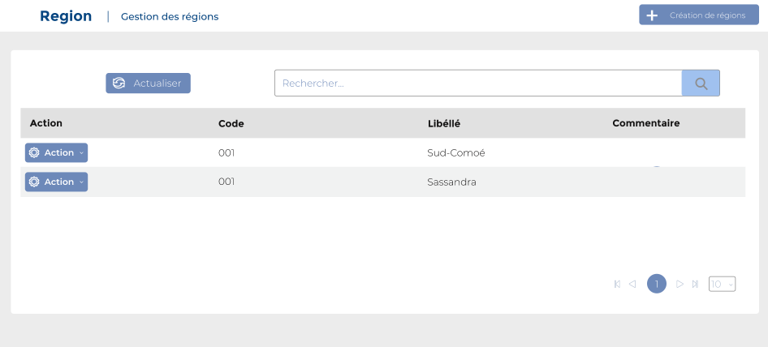
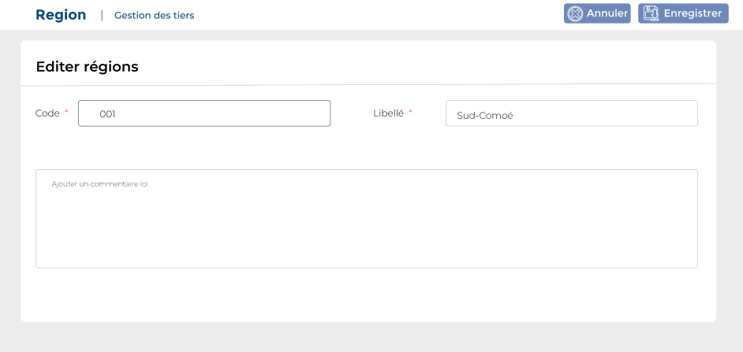

# Regions

Cette option permet de gérer les régions.

### **Edition de la fiche :** Régions&#x20;

**NB :** Seule les zones en astérisque (\*) de cet écran sont obligatoire.

* **Code :** Indiquez le code.
* **Libellé :** Indiquez le libellé.
* **Commentaire :** Indiquez le commentaire.

###
