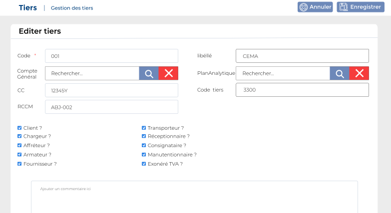

# Tiers

Cette option permet de gérer les tiers.

### **Edition de la fiche :** Tiers

Pour créer un site cliquez sur cliquez sur **«Créer un incoterms »** Ensuite renseigner les champs suivant :&#x20;

**NB :** Seule les zones en astérisque (\*) de cet écran sont obligatoire.

* **Code :** Indiquez le code.
* **Libellé:** Indiquez le libellé
* **Compte général :** Indiquez le Compte général
* **Plan analytique :** Indiquez le plan analytique
* **CC :** Indiquez le compte contribuable  Indiquez
* **Code tiers :** Indiquez le code tiers
* **RCCM :** Indiquez le registre de commerce&#x20;
* **Client, Transporteur, Chargeur, Réceptionnaire, Affréteur, Consignataire, Armateur, Manutentionnaire, Fournisseur, Chauffeur, Transitaire, Propriétaire Exonéré, TVA** : Cochez les éléments ci-dessus ci nécessaire.&#x20;

### **Onglet : Contact**

Cet onglet vous permet d'ajouter les contacts de la société  : cliquez sur le bouton "**Ajouter contact**"

* **Type contact** : indiquez le type de contact
* **Libellé** : indiquez le libellé

.PNG>)
