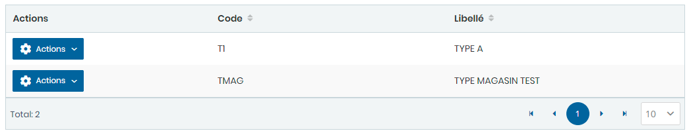
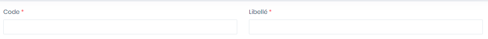

# Types Magasins

Cette option permet de gérer les types de magasin.

**Edition de la fiche : Type Magasin**

**NB :** Seule les zones en astérisque (\*) de cet écran sont obligatoires.

* **Code:** Indiquez le code.
* **Libellé :** Indiquez le libellé

