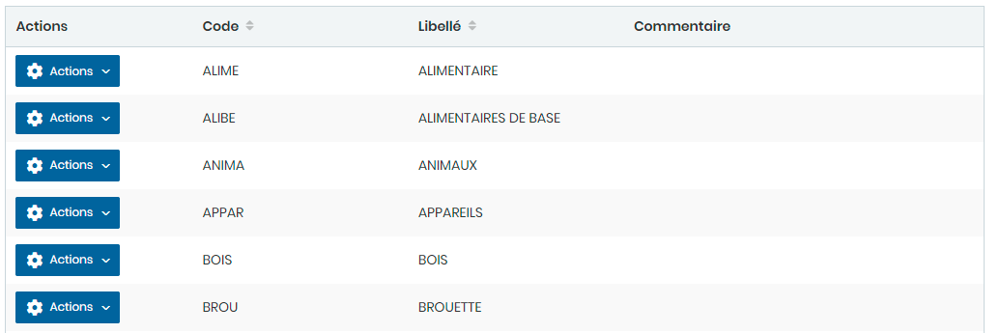

# Type produits

Cette option permet de gérer les Types produits.

**Edition de la fiche : Type produits**

**NB :** Seule les zones en astérisque (\*) de cet écran sont obligatoire.

* **Code :** Indiquez le code.
* **Libellé :** Indiquez le libellé.
* **Commentaire :** Indiquez le commentaire

