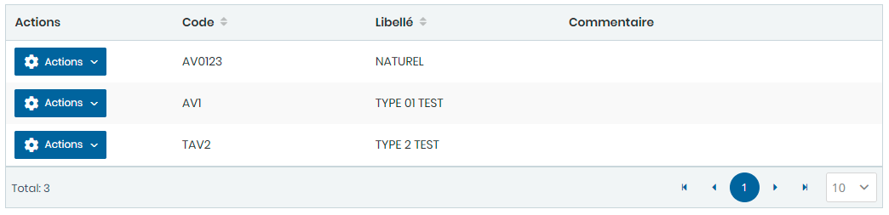

# Type Avaries

Cette option permet de gérer les **Type Avaries**.

**Edition de la fiche : Type Avaries**

**NB :** Seule les zones en astérisque (\*) de cet écran sont obligatoires.

* **Code:** Indiquez le libellé.
* **Libellé:** Indiquez le code banque.

