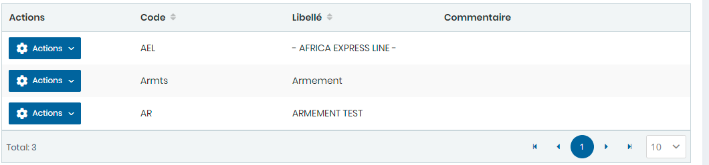
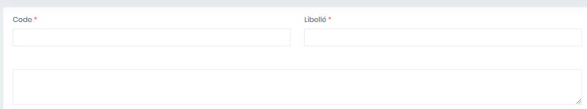

# Armements

Cette option permet de gérer les armements.

**Edition de la fiche : Armements**

**NB :** Seule les zones en astérisque (\*) de cet écran sont obligatoire.

* **Code:** Indiquez le code
* **Libellé:** Indiquez le libellé
* **Commentaire :** Indiquez le commentaire

