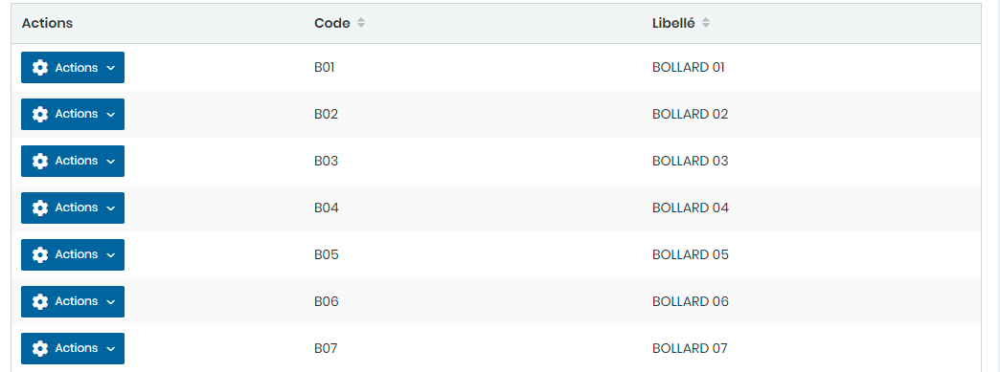
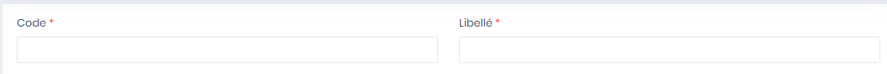

# Bollard

Cette option permet de gérer les bollards.

**Edition de la fiche : Bollards**

**NB :** Seule les zones en astérisque (\*) de cet écran sont obligatoires.

* **Code :** Indiquez le code
* **Libellé :** Indiquez la désignation&#x20;

