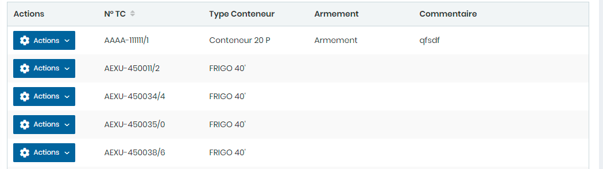
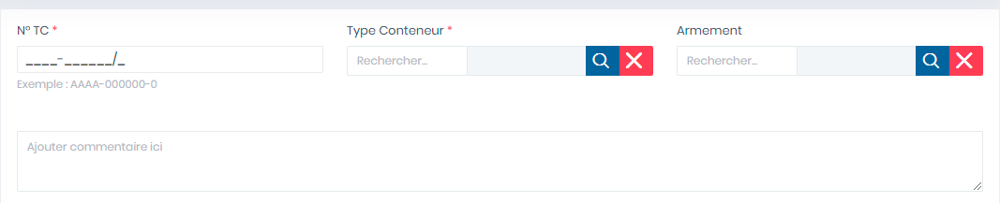

# Conteneurs

Cette option permet de gérer les conteneurs.

**Edition de la fiche : Conteneurs**

**NB :** Seule les zones en astérisque (\*) de cet écran sont obligatoire.

* **N° TC :** Indiquez le numéro du conteneur
* **Type Conteneur :** Indiquez le type conteneur&#x20;
* **Armement :** Indiquez l'armement&#x20;
* **Commentaire :** Indiquez le commentaire

