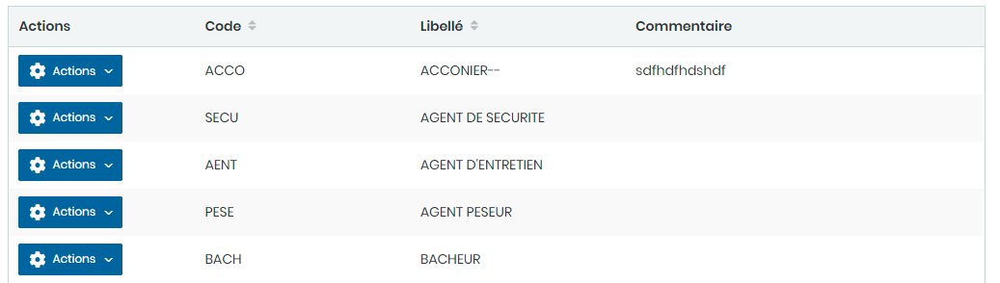

# Fonctions Dockers

Cette option permet de gérer les Fonctions Dockers.

**Edition de la fiche : Fonctions Dockers**

**NB :** Seule les zones en astérisque (\*) de cet écran sont obligatoires.

* **Code:** Indiquez le code
* **Libellé:** Indiquez le libellé
* **Commentaire :** Indiquez le commentaire

