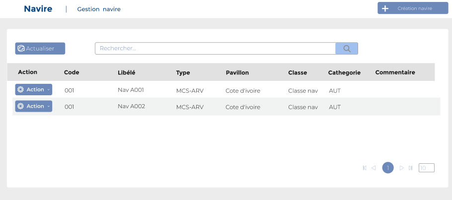
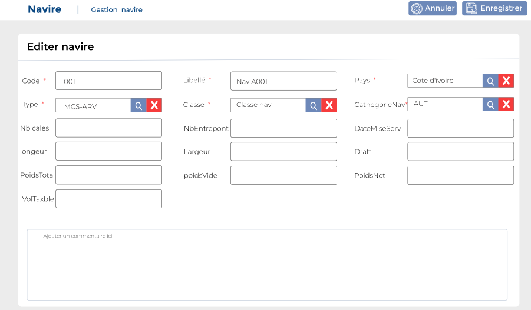

# Navires

Cette option permet de gérer le navires.

**Edition de la fiche : Navires**

**NB :** Seule les zones en astérisque (\*) de cet écran sont obligatoire.

* **Code :** Indiquez le Code
* **Libellé :** Indiquez le libellé
* **Pays :** Indiquez le pays
* **Type :** Indiquez le type&#x20;
* **Classe :** Indiquez la classe&#x20;
* **CategNavire :** Indiquez la catégorie navire
* **Nb Cales :** Indiquez le nombre de cales
* **Nb Entrepont :** Indiquez le nombre d'entrepont&#x20;
* **Date mise en service :** Indiquez la date de mise en service&#x20;
* **Longueur :** Indiquez la longueur&#x20;
* **Largeur :** Indiquez a largeur&#x20;
* **Draft :** Indiquez le draft
* **Poids total charge :** Indiquez le poids totale
* **Poids Vide :** Indiquez le poids vide du navire
* **Poids Net :** Indiquez le poids net du navire
* **Volume :** Indiquez le volume
* **Taxable :** Indiquez la taxable&#x20;
* **Commentaire :** Indiquez le commentaire

