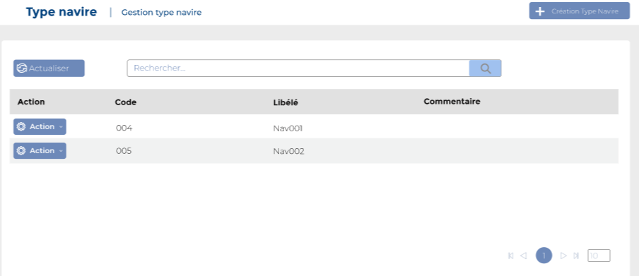

# Types navires

Cette option permet de gérer le type navire.

**Edition de la fiche : Types navires**

**NB :** Seule les zones en astérisque (\*) de cet écran sont obligatoire.

* **Code :** Indiquez le code
* **Désignation :** Indiquez la désignation&#x20;
* **Commentaire :** Indiquez le commentaire

