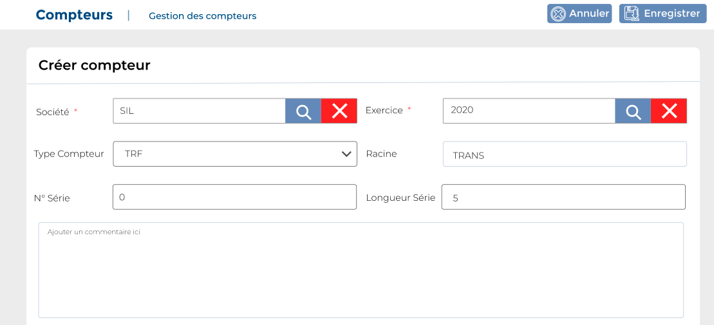

# Compteurs

Cette option vous permet de gérer les  compteurs.

.PNG>)

### **Edition de la fiche : Compteur**.

**NB :** Seule les zones en astérisque (\*) de cet écran sont obligatoire.

* **Société**: indiquez la société.&#x20;
* **Exercice**: indiquez l'exercice
* **Type compteur**: Indiquez  le type compteur
* **Racine** : Indiquez la racine du compteur
* **N° Série**: indiquez le numéro de série
* **Longueur** : Indiquez la longueur du compteur
* **Commentaire** : Indiquez le commentaire

