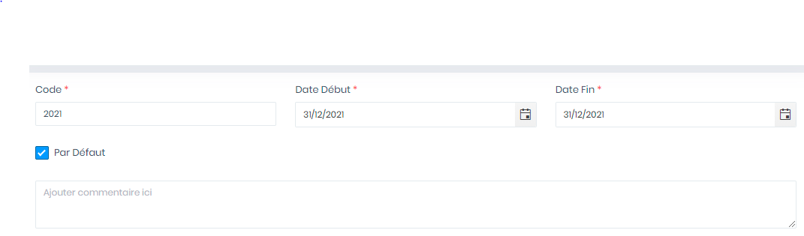
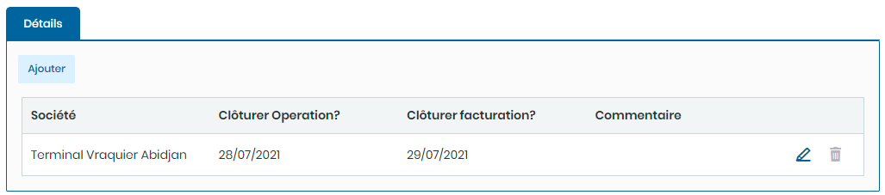

# Exercices

Cette option vous permet de gérer les  exercices.

.PNG>)

### **Edition de la fiche : Exercice**

L' écran de l'exercice se divise en deux parties. La première partie concerne les informations générales sur l'exercice et la seconde détermine les périodes de clôture de cet exercice.

**NB :** Seule les zones en astérisque (\*) de cet écran sont obligatoire.

**1ère partie** :

* **Code**: indiquez le code.&#x20;
* **Date début**: indiquez la date de début de l'exercice
* **Date fin**: Indiquez  la date de fin de l'exercice
* **Défaut**: Indiquez l'exercice par défaut
* **Commentaire** : Indiquez le commentaire

**2è partie : Details**&#x20;

* **Société** : indiquez la société.&#x20;
* **Clôturer Opération?**: indiquez la date de clôture des l'opérations.
* **Clôturer facturation?**: Indiquez  la date de clôture de la facturation.
* **Commentaire** : Indiquez le commentaire.

