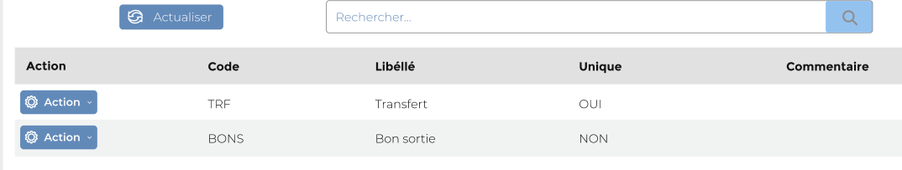
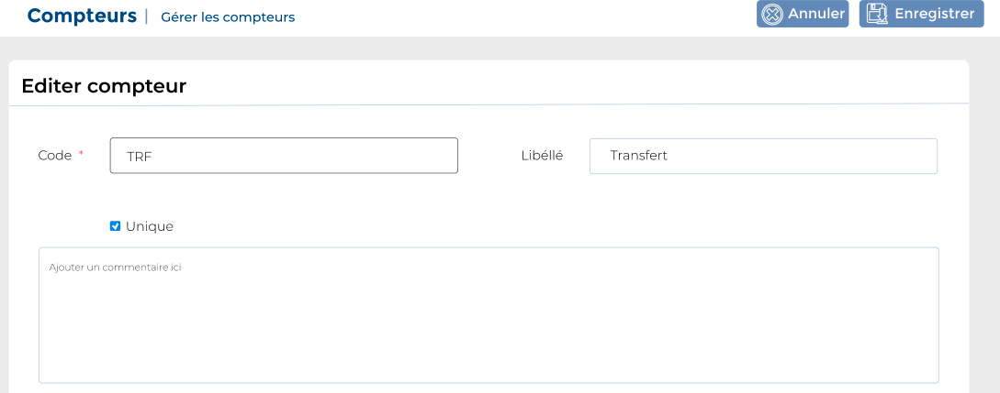

# Types compteurs

Cette option vous permet de gérer les Types de compteur.

### **Edition de la fiche : Type de compteur**.

**NB :** Seule les zones en astérisque (\*) de cet écran sont obligatoire.

* **Code**: indiquez la raison sociale.&#x20;
* **Libellé**: indiquez le sigle
* **Unique**: Indiquez l'unicité du type compteur
* **Commentaire**: indiquez le commentaire.

