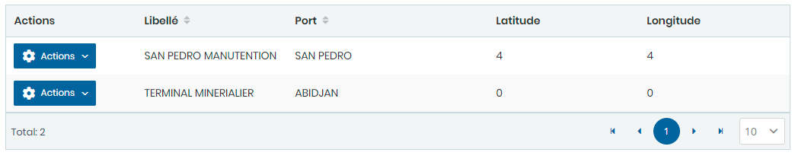
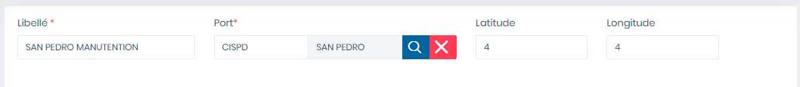
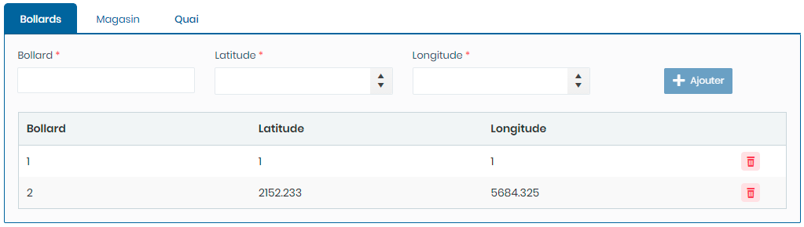
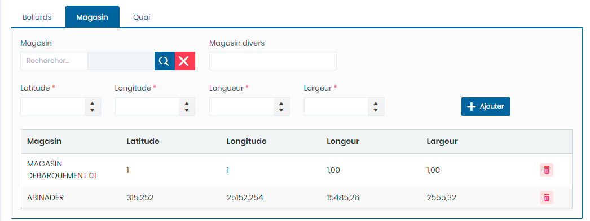
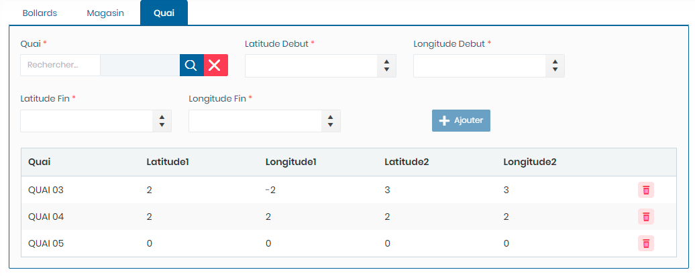

# Disposition à quai

Cette option vous permet de gérer les positions des navires à quai.

### **Edition de la fiche : Disposition à quai**

L' écran de **disposition à quai** se divise en quatre parties.

* La première partie concerne les informations générales sur la disposition à quai. La seconde partie permet d'enregistrer la position des navire à proximité des bollard.
* La seconde partie permet d'enregistrer la position des navire à proximité des magasin.
* La quatrième partie permet d'enregistrer la position des navire à proximité des quais.

**NB :** Seule les zones en astérisque (\*) de cet écran sont obligatoire.

**1ère partie** : informations générales

* **Libellé**: indiquez le libellé.&#x20;
* **Port**: indiquez le port
* **Latitude**: Indiquez  la valeur en latitude
* **Longitude**: Indiquez la valeur en longitude

**2ème partie** : Onglet **Bollard**

* **Bollard**: indiquez le bollard.&#x20;
* **Latitude**: Indiquez  la valeur en latitude
* **Longitude**: Indiquez la valeur en longitude

**3ème partie** : Onglet **Magasin**

* **Magasin** : indiquez le magasin.&#x20;
* **Magasin divers** : Indiquez le magasin divers
* **Latitude**: Indiquez  la valeur en latitude
* **Longitude**: Indiquez la valeur en longitude
* **Longueur** : Indiquez la valeur en longueur
* **Largeur** : Indiquez la valeur en largeur.

**4ème partie** : Onglet **Quai**

* **Quai**: indiquez le quai.&#x20;
* **Latitude début** : Indiquez  la valeur de la latitude début
* **Longitude début** : Indiquez la valeur de la longitude début
* **Latitude  fin** : Indiquez la valeur de la longueur de fin
* **Longitude fin** : Indiquez la valeur en largeur de fin.

