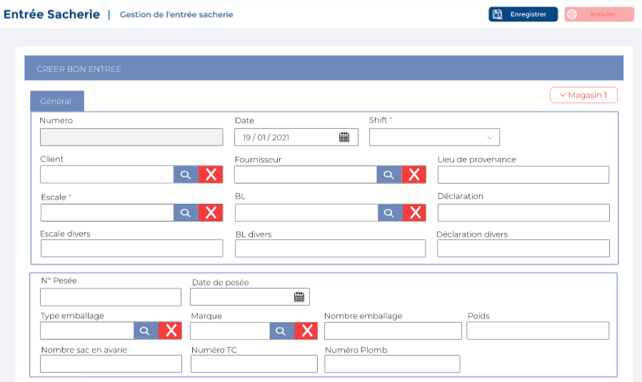

# Sortie Sacheries

Cette option permet de gérer les sorties de sacs.

### **Edition de la fiche : sortie sacheries**

Cette fiche se divise en deux parties. La première partie présente les informations générales sur les entrées sacheries. La deuxième partie concerne le détail.

**1ère partie : Général**

* **Numéro :** Indiquez le numéro
* **Date :** Indiquez la date
* **Shift :** Indiquez le shift
* **Client :** Indiquez le client
* **Destination :** Indiquez la destination
* **Destinataire :** Indiquez le destinataire
* **Escale :** Indiquez l'escale
* **Bill Of Lading :** Indiquez le bill of lading
* **Déclaration :** Indiquez la déclaration
* **Escale Divers :** Indiquez l'escale divers
* **BL Divers :** Indiquez le bl divers
* **Déclaration Divers :** Indiquez la déclaration divers
* **ODP :** Indiquez l'odp
* **Numéro BAD :** Indiquez le numéro bad
* **Date BAD :** Indiquez la date bad
* **Numéro :** Indiquez le numéro
* **Pesée :** Indiquez la pesée
* **Type Emballage :** Indiquez le type emballage
* **Marque :** Indiquez la marque&#x20;
* **Nb Emballage :** Indiquez le nombre d'emballage
* **Poids Brut (kg) :** Indiquez le poids brut
* **Nb Sacs :** Indiquez le nombre de sacs
* **Avaries :** Indiquez l'avarie
* **N° TC :** Indiquez le N° tc
* **N° Plomb :** Indiquez le N° plomb

**2 ère partie : Détail**

* **Camion :** Indiquez le camion
* **Remorque :** Indiquez la remorque
* **Chauffeur :** Indiquez le chauffeur&#x20;
* **Divers Camion :** Indiquez le divers camion
* **Divers Remorque :** Indiquez le divers remorque
* **Divers Chauffeur :** Indiquez le chauffeur
* **Lieu destination :** Indiquez le lieu de destination
* **N° PC :** Indiquez le n**°** pc
* **Date PC :** Indiquez le la date pc
* **Lieu Délivrance :** Indiquez le lieu de délivrance
* **Transporteur :** Indiquez le transporteur

