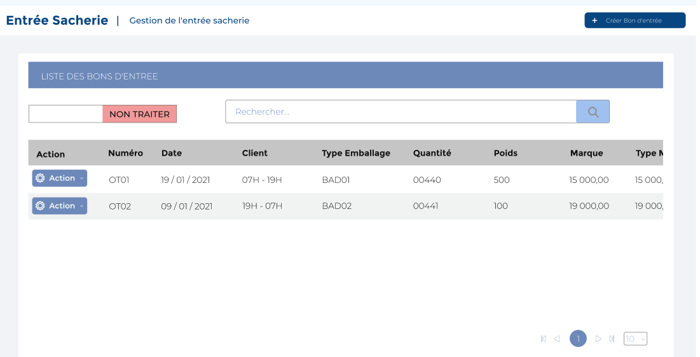
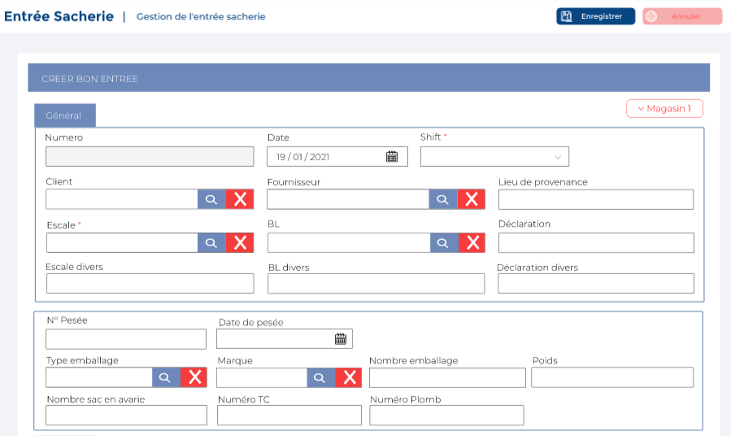

# Transferts Sorties Sacheries

Cette option permet de gérer les transfert de sacs vers d'autres magasins tierces.

### **Edition de la fiche : Transfert entrée sacherie**

Cette fiche se divise en deux parties. La première partie présente les informations générales sur les entrées sacheries. La deuxième partie concerne le détail.

**1ère partie : Général**

* **Numéro :** Indiquez le numéro
* **Date :** Indiquez la date
* **Shift :** Indiquez le shift
* **Client :** Indiquez le client
* **Fournisseur :** Indiquez le fournisseur
* **Lieu de provenance :** Indiquez le lieu de provenance
* **Escale :** Indiquez l'escale
* **Bill Of Lading :** Indiquez le Bill Of Lading
* **Déclaration :** Indiquez la déclaration
* **Escale Divers :** Indiquez l' escale divers
* **BL Divers :** Indiquez le bl divers
* **Déclaration :** Indiquez la déclaration
* **Divers :** Indiquez le divers

**2 ère partie : Détail**

* **Camion :** Indiquez le camion
* **Remorque :** Indiquez la remorque
* **Chauffeur :** Indiquez le chauffeur&#x20;
* **Divers Camion :** Indiquez le divers camion
* **Divers Remorque :** Indiquez le divers remorque
* **Divers Chauffeur :** Indiquez le chauffeur
* **N° PC :** Indiquez le n**°** pc
* **Date PC :** Indiquez le la date pc
* **Lieu Délivrance :** Indiquez le lieu de délivrance
* **Transporteur :** Indiquez le transporteur
