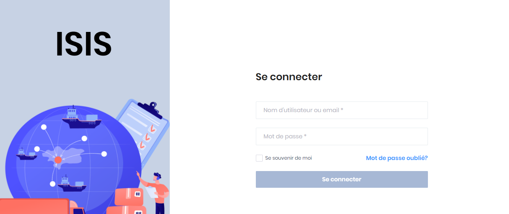
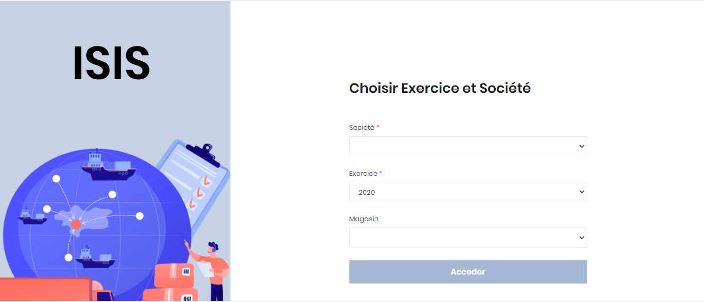

# Ouverture de session

Pour accéder à ISIS, veuillez ouvrir dans votre navigateur internet(Chrome, Firefox, Microsoft Edge, etc.) l’adresse qui vous a été communiquer. Après le chargement de l’application vous accéder à l’écran d’ouverture de sessions.


&#x20;Tout utilisateur de ISIS doit disposer d’un profil utilisateur. Veuillez-vous rapprocher de votre administrateur afin de récupérer vos paramètres de connexion..


**La connexion à ISIS se fait en deux étapes :**

**Etape 1 :**

* Veuillez indiquer votre nom d'utilisateur ou adresse email de connexion qui vous a été communiqué par votre administrateur
* Ensuite indiquez le mot de passe.
* Puis, cliquez sur le bouton **Se connecter**

**Etape 2 :**

* Sélectionnez la société sur laquelle vous souhaitez travailler
* Sélectionnez l'exercice sur lequel vous voulez travailler
* Sélectionnez le magasin sur laquelle vous voulez travailler
* Puis cliquer sur le bouton **Accéder**

