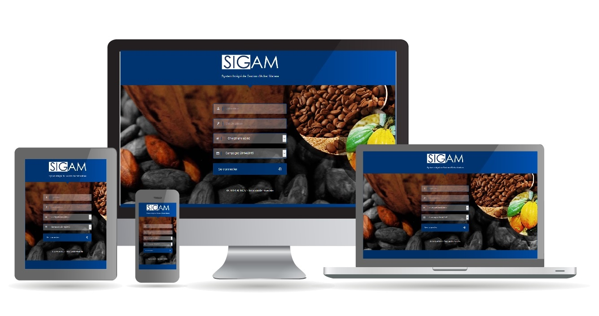

# SIGAM (Système Intégré de Gestion des Achats Matières)

SIGAM est un logiciel de gestion des achats de produits agricoles en général et du café et cacao en particulier.&#x20;

SIGAM a été réalisé dans la vision de mettre à votre disposition un logiciel ergonomique et simple à prendre en main. En dehors des ordinateurs liés à un pont bascule, SIGAM ne nécessite aucune installation sur les postes des utilisateurs. Seul un navigateur internet est nécessaire.&#x20;

SIGAM dispose d’une interface utilisateur Responsive Design, lui permettant de s’adapter à tous vos périphériques (ordinateur, tablette et smartphone).
