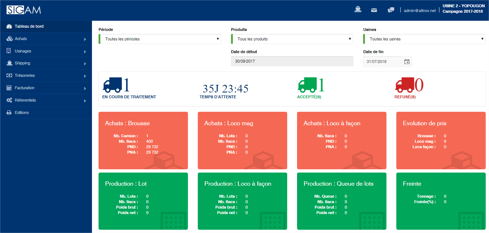
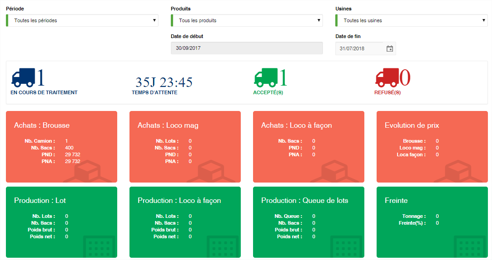

# Interface

L’écran principal de SIGAM se découpe en quatre grandes zones :

&#x20;**1. Barre horizontale en haut**

Dans cette barre vous avez accès aux notifications, aux messages, à l’activation de l’écran de conversation (tchat) et au menu de l’administration. Complètement à droite, vous pouvez consulter la campagne et l’usine actuellement activées.

&#x20;**2. Menu de l’application**

Le menu de l’application se trouve dans la barre à gauche de l’écran et vous permet d’accéder aux différentes fonctionnalités de SIGAM. Cette barre se rétracte automatiquement lorsque vous activez les conversations (tchat).

&#x20;**3. Zone de travail (au centre)**

Cette zone affiche les différents écrans (saisies et liste) de l’application en fonction des fonctionnalités que vous activez.

&#x20;**4. Zone de conversation (tchat)**

En cliquant sur l’icone de conversation, une zone verticale s’affichera automatiquement à droite de l’écran. Elle vous permet de voir les utilisateurs connectés à l’application et de discuter avec eux directement au sein de l’application.

