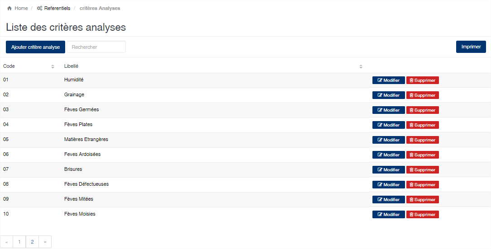
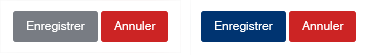
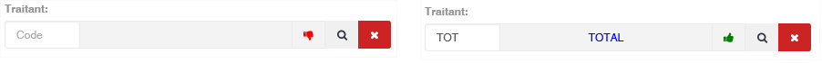

# Navigation dans SIGAM

SIGAM a été conçu afin de faciliter sa prise en main. La navigation au sein de l’application est facilitée par l’ergonomie de l’application.

&#x20;**1. Les listes**

En accédant à une option de menu de l’application, vous obtenez généralement une liste affichant les données déjà existantes dans l’application.

Les possibilités offertes par la liste sont généralement :

* **Ajouter un nouvel élément** : Vous disposez d’un bouton en haut à gauche de la liste.
* **Rechercher un élément** : Vous disposez d’une zone de recherche où vous pouvez saisir les mots recherchés. La liste se filtrera en conséquence pour vous afficher les éléments correspondants à la recherche.
* **Imprimer la liste** : Vous disposez d’un bouton en haut à droite pour imprimer l’état associé à la liste.
* **Boutons d’action** : Pour chaque élément de la liste vous avez des boutons d’action qui vous permettent d’effectuer des opérations sur l’élément sélectionné. Par exemple modifier ou supprimer l’élément sélectionné.
* **Navigateur de page** : en bas à droite de la liste, lorsque la liste est trop longue, le navigateur de page est visible et vous permet de vous déplacer dans les différentes pages de la liste.
* **Trier la liste** : En cliquant sur les entêtes de colonnes vous pouvez trier la liste en fonction de la colonne. L’ordre de tri est modifié en cliquant successivement sur l’entête de colonne. Si la liste est croissante, cliquez l’entête de colonne la rends décroissante et vice-versa.

&#x20;**2. Les boutons de validation**

Lorsque vous modifiez un élément vous disposez de deux boutons de validation qui se trouvent généralement en bas à gauche de l’écran.

* Le bouton « **Enregistrer** » vous permet de valider vos modifications.&#x20;
* Le bouton « **Annuler** » vous permet d’annuler vos modifications et de retourner sur la liste précédente.

Lorsque toutes les zones obligatoires de l’écran que vous éditez sont renseignées, le bouton « **Enregistrer** » s’active et devient bleu, vous permettant ainsi d’enregistrer vos modifications.

&#x20;**3. Les sélecteurs**

Les sélecteurs vous permettent de sélectionner un élément soit en tapant son code dans la zone prévue à cet effet, soit en le sélectionnant dans une liste. Le sélecteur présente les zones suivantes :

* **La zone « Code »** : permet de saisir directement le code de l’élément recherché.&#x20;
* **La zone d’information** : Cette zone est rouge lorsque le contenu du sélecteur n’existe pas dans l’application et devient verte dans le cas contraire.&#x20;
* **Bouton « Loupe »** : Ce bouton affiche une liste qui vous permet de rechercher et sélectionner l’élément voulu.&#x20;
* **Le bouton rouge** : Ce bouton permet d’effacer les données du sélecteur.


&#x20;Les zones ayant une barre rouge à gauche sont des zones obligatoires. Vous devez obligatoirement indiquer une valeur. Lorsque toutes les zones obligatoires sont renseignées, le bouton « **Enregistrer** » s’active et devient bleue, vous permettant ainsi d’enregistrer vos modifications

