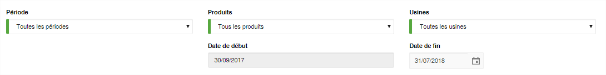
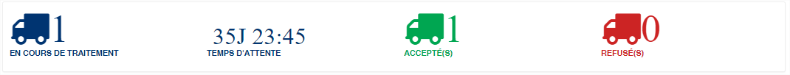
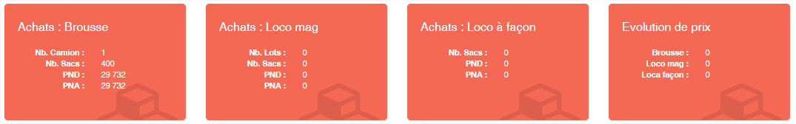
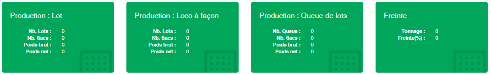
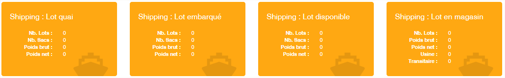
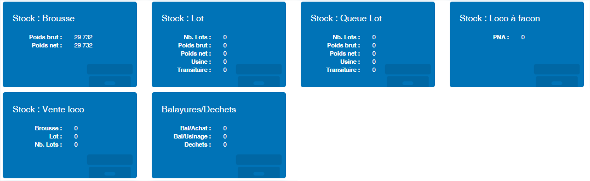
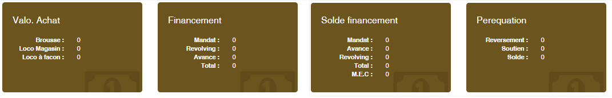

# Tableau de bord

Le tableau de bord vous offre une vue synthétique des activités des opérations de votre entreprises. Ils se présente en trois grandes parties.

### **Les filtres**

La zone de filtres permet de définir la sélection des données à afficher sur le tableau de bord. Toute les zones du filtre appliquent une sélection inclusive.

* **Période** : Vous pouvez filtrer sur une période de la campagne.&#x20;
* **Produits** : Vous pouvez filtrer sur un produit spécifique ou tous les produits&#x20;
* **Usines** : Vous pouvez filt**r**er sur une usine spécifique ou toutes les usines&#x20;
* **Date de début** : Cette date ne peut être modifié. Elle correspond par défaut à la date début de la campagne.&#x20;
* **Date de fin** : Vous pouvez indiquer la date de fin des données à afficher dans le tableau de bord. Par défaut c’est la date du jour qui est indiquée.

### **Les camions déchargés**

Cette zone vous permet d’avoir en temps réel les camions déchargés. Elle se divise en quatre zones.

* Les camions en cours de déchargement sur vos plateformes.
* Le temps moyens de traitement d’un camion.
* Le nombre de camions acceptés depuis le début de la campagne.
* Le nombre de camions rejetés depuis le début de la campagne.

### **Les vignettes de synthèse**

Les vignettes de synthèse présente les données importante en fonction des différents secteurs opérationnels**.**

&#x20;**Les données sur les achats**

&#x20;**Les données sur la production**

&#x20;**Les données sur le shipping**

&#x20;**Les données sur le stock**

&#x20;**Les données sur les finances**

