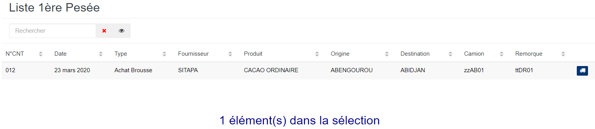
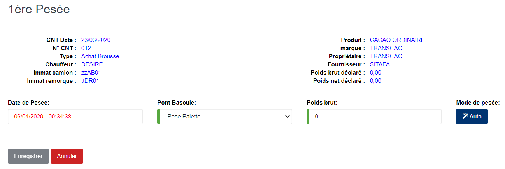

# 1ère Pesée

Cette fonctionnalité vous permet de capter les poids des camions chargés de produits qui arrivent au pont bascule.

### **Edition de la fiche : 1ère Pesée**

Pour avoir le poids brut du camion chargé, vous devez cliquez sur le bouton « **Auto** » ou saisir le poids brut (en fonction de votre profil)

* **Pont bascule** : indiquez le pont bascule.
* **Poids brut** : indiquez le poids brut.

