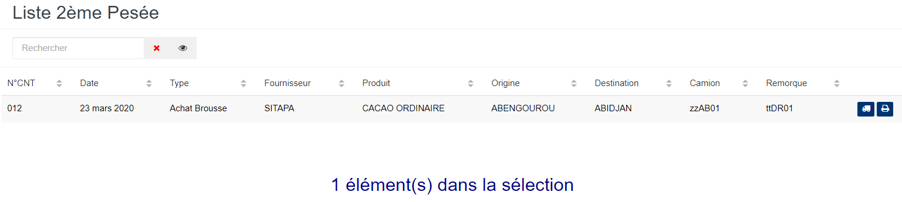
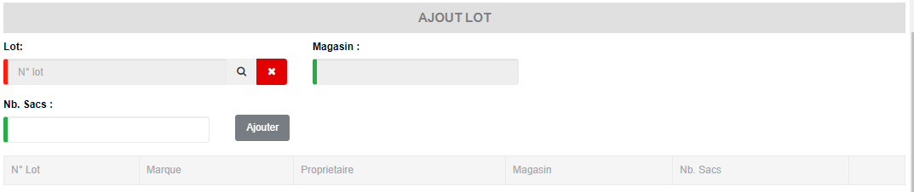
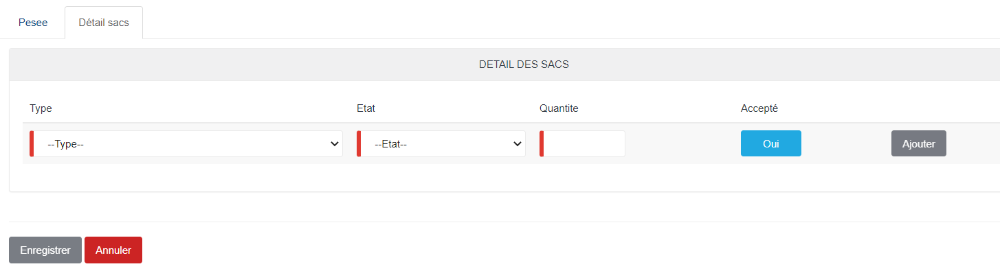
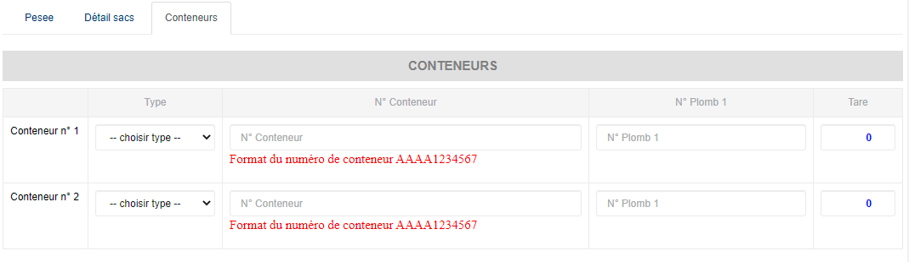

# 2eme Pesée

Cette fonctionnalité vous permet de capter les poids des camions à vide qui arrivent au pont bascule.

### **Edition de la fiche : 2eme Pesée**

L'écran d'édition se divise en deux parties. La première permet d'indiquer les informations de la Pesée et la deuxième vous permet de définir les  poids des différents connaissements à transférer.

**1ère partie : Onglet Pesée**

Pour avoir le poids brut du camion à vide, vous devez cliquez sur le bouton « **Auto** » ou saisir le poids brut (en fonction de votre profil)

les zones ci-dessous de cet écran sont obligatoires.

* **Pont bascule** : indiquez le pont bascule.
* **Poids brut** : indiquez le poids brut.
* **Nb sacs déchargés/chargés** : indiquez le nombre de sacs déchargés ou chargés.
* **Chauffeur** : indiquez le nom du chauffeur.
* **Lot** : indiquez le numéro de lot (si et seulement si la pesée concerne un lot complet)
* **Immat camion** : indiquez l'immatriculation du camion.
* **Immat remorque** : indiquez l'immatriculation de la remorque.

.PNG>)

**Ajout de plusieurs queues de lots :**&#x20;

* **Lot bascule** : indiquez le pont bascule.
* **Magasin brut** : indiquez le poids brut.
* **Nb sacs** : indiquez le nombre de sacs déchargés ou&#x20;
* **Ajouter** : cliquer sur le bouton "**Ajouter**" un lot

**2ème partie : Onglet Détails sacs**

* **Type**: indiquez le pont bascule.
* **Etat** : indiquez le poids brut.
* **Quantité** : indiquez le nombre de sacs déchargés ou&#x20;
* **Accepté** : "**Oui**" ou "**Non**"
* **Ajouter** : cliquer sur le bouton "**Ajouter**" une ligne

**3ème partie : Onglet Conteneurs**

* **Conteneur 1: Type** : indiquez le type de conteneur 1.
* **Conteneur 1:** **N° Conteneur** : indiquez le numéro du conteneur 1.
* **Conteneur 1: N° Plomb 1** : indiquez le numéro du Plomb 1.
* **Conteneur 1: Tare**  : indiquez la tare du conteneur 1.
* **Conteneur 2: Type** : indiquez le type de conteneur 2.
* **Conteneur 2:** **N° Conteneur** : indiquez le numéro du conteneur 2.
* **Conteneur 2: N° Plomb 2** : indiquez le numéro du Plomb 2.
* **Conteneur 2: Tare**  : indiquez la tare du conteneur 2.

