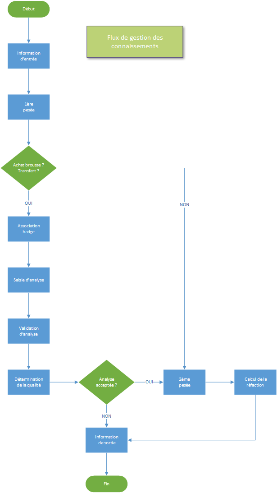

# Achats

Le module des achats vous donne accès aux fonctionnalités de gestion des mouvements de produits au niveau du pont bascule et les plateformes de chargement et de déchargement.

Les différents type de connaissements (documents) suivent un workflow prédéfinis qui est le suivant :

