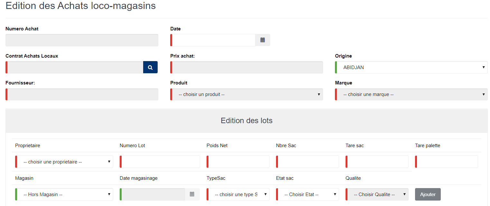

# Achat loco magasin

Cette fonctionnalité vous permet de gérer les cessions des lots usinés qui proviennent d'un fournisseur.

## **Edition de la fiche : Balayures**

* **Date** : indiquez la date de saisie.
* **Contrats achats locaux** : indiquez le contrat de cession.
* **Prix d'achat** : indiquez le prix d'achat du produit.
* _\*Origine_ : indiquez l'origine du produit.
* **Fournisseur** : indiquez le fournisseur.
* **Produit** : indiquez le produit.
* **Marque** : indiquez la marque.
* **Propriétaire** : indiquez le propriétaire.
* **Numéro de lot** : indiquez le numéro de lot.
* **Poids Net** : indiquez le poids net du lot.
* **Nbre sac** : indiquez le nombre de sacs.
* **Tare sac** : indiquez la tare des sacs.
* **Tare palette** : indiquez la tare de la palette.
* **Date magasinage** : indiquez la date d'entrée en magasin.
* **Type sacs** : indiquez le type de sac.
* **Etat sac** : indiquez l'état des sacs .
* **Qualité** : indiquez la qualité des produits.

Cette fonctionnalités vous permet de remplacer uniquement le produit d'un connaissement par un autre de même famille que le premier.

Vous pouvez utiliser cette fonctionnalité si le connaissement à fait sa deuxième pesée.

les zones ci-dessous de cet écran sont obligatoires.

* **N° CNT** : indiquez le numéro du connaissement.
* **Choisir un produit** : indiquez le produit correct.
