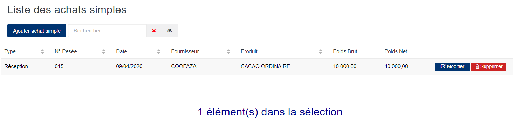

# Achat Simple

Cette fonctionnalité vous permet de gérer les stocks(entrées et sorties) des produits bords-champs.

### **Edition de la fiche : Achat Simple**

L'écran d'édition se divise en deux parties. La première permet d'indiquer les informations du connaissement et la deuxième vous permet de définir les détails concernant les poids et les sacs.

**1ère Partie** :

* **Type mouvement** : indiquez le type de mouvement.
* **Date** : indiquez la date de saisie.
* **traitant/Fournisseur** : indiquez le fournisseur du produit.
* **Produit** : indiquez le produit.
* **Exportateur/Propriétaire** : indiquez le propriétaire du produit.
* **Marque** : indiquez la marque du produit.
* **Origine** : indiquez l'origine du produit.
* **Destination** : indiquez la destination du produit.
* **Chauffeur** : indiquez le chauffeur
* **Immat camion** : indiquez l'immatriculation du camion.
* **Immat remorque** : indiquez l'immatriculation de la remorque.
* **Poids brut Déclaré** : indiquez le poids brut déclaré .
* **Poids net Déclaré** : indiquez le poids net déclaré .
* **Nb Sacs Déclaré** : indiquez le nombre de sacs déclarés .
* **Type de sacs** : indiquez le type de sac.
* **Etat des sacs** : indiquez l'état des sacs.
* **Nb.Sacs** : indiquez le nombre de sacs.

.PNG>)

**2ème Partie** :

Pour avoir le poids brut du camion chargé, vous devez cliquez sur le bouton « **Auto** » ou saisir le poids brut (en fonction de votre profil)

* **Nb. Sacs** : indiquez le nombre de sac.
* **Pèse Palette** : indiquez la pèse palette.
* **Poids** : indiquez le poids.
* **Ajouter** : cliquez sur le bouton "**Ajouter**" pour ajouter une pesée.

.PNG>)
