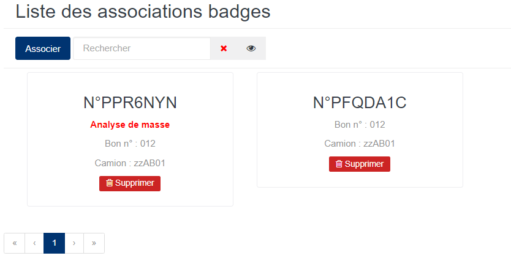
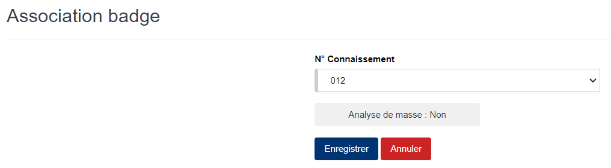

# Association Badge

Cette fonctionnalité vous permet de gérer les codifications des échantillons des produits à analyser.

### **Edition de la fiche : Association de Badge**

Pour faire une analyse de masse, vous devez cliquer sur le bouton « **Analyse de masse: Non** » pour l'activer en « **Analyse de masse: Oui** ».

* **N° Connaissement** : indiquez le numéro de connaissement.

