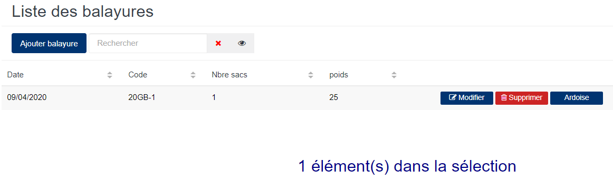
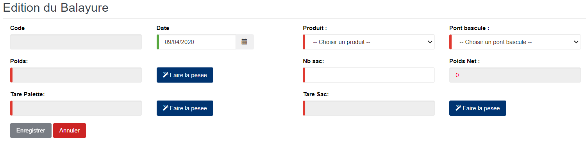

# Balayures

Cette fonctionnalité vous permet de gérer le stock des balayures brousses.

### **Edition de la fiche : Balayures**

les zones ci-dessous de cet écran sont obligatoires.

* **Date** : indiquez la date de saisie.
* **Produit** : indiquez le produit.
* **Pont bascule** : indiquez le pont bascule.
* **Poids** : indiquez le poids du produit.
* **Nb sac** : indiquez le nombre de sacs.
* **Tare Sac** : indiquez la tare de sac.
* **Tare Palette** : indiquez la tare de la palette.

