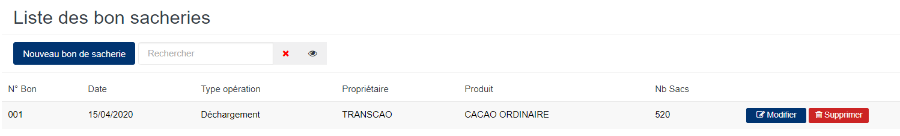
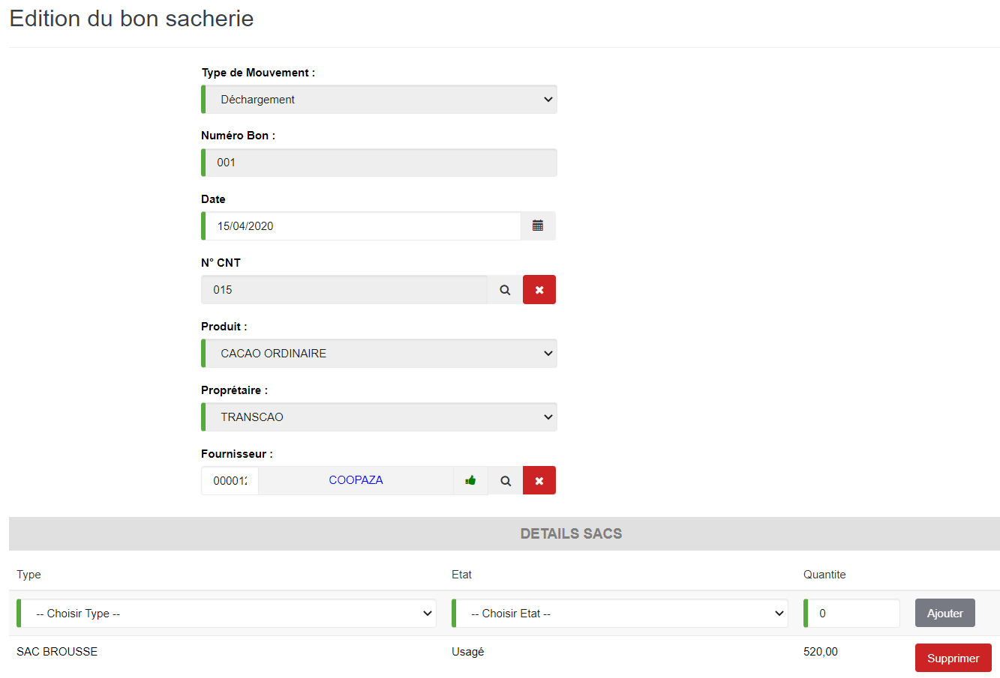

# Bon sacherie

Cette fonctionnalité vous permet de gérer le stock de la sacherie.

### **Edition de la fiche : Bon sacherie**

les zones ci-dessous de cet écran sont obligatoires.

* **Type de mouvement** : indiquez le type de mouvement.
* **Numéro Bon** : indiquez le numéro de bon.
* **Date** : indiquez la date de saisie.
* **Produit** : indiquez le produit.
* **Propriétaire** : indiquez le propriétaire.
* **Fournisseur** : indiquez le fournisseur.
* **Type de sac** : indiquez le type de sac.
* **Etat de sac** : indiquez l'état de sac.
* **Quantité** : indiquez le nombre de sacs.

