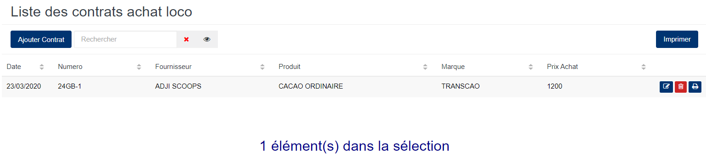
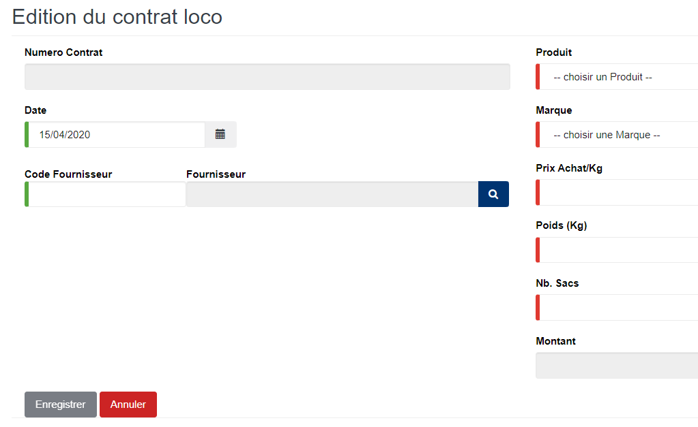

# Contrat loco magasin

Cette fonctionnalité vous permet de gérer les contrats de cession des lots usinés.

### **Edition de la fiche : Contrat loco magasin**

les zones ci-dessous de cet écran sont obligatoires.

* **Date** : indiquez la date de saisie.
* **Fournisseur** : indiquez le fournisseur.
* **Produit** : indiquez le produit.
* **Marque** : indiquez la marque.
* **Nb. Sacs** : indiquez le nombre de sacs.
* **Prix d'achat** : indiquez le prix d'achat du produit.
* **Poids** : indiquez le poids.

