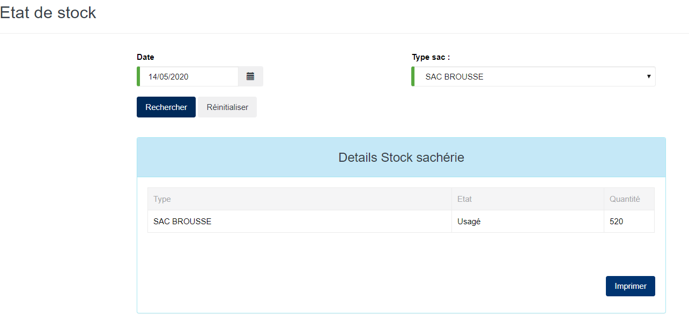

# Etat Stock

Cette fonctionnalité vous permet de visualiser l'état du stock de la sacherie.

les zones ci-dessous de cet écran sont obligatoires.

* **Date** : indiquez le numéro du connaissement.
* **Type sac** : indiquez le type de sac.

