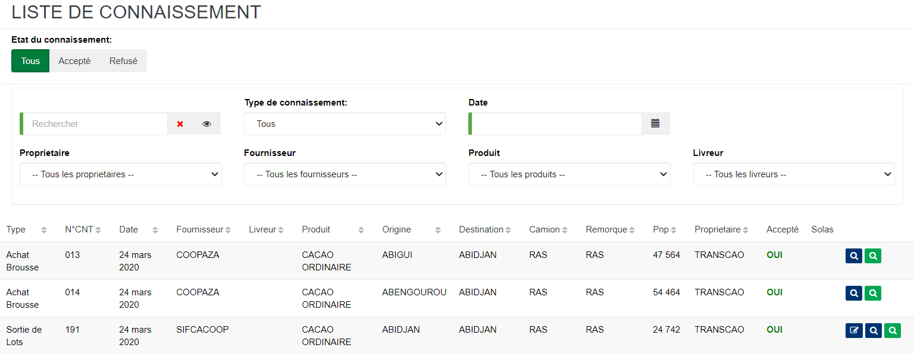
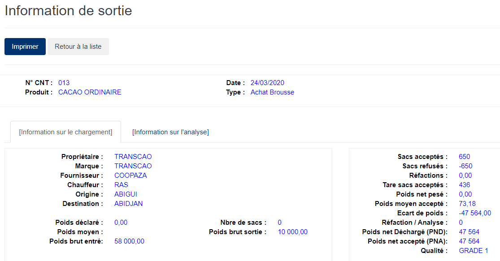
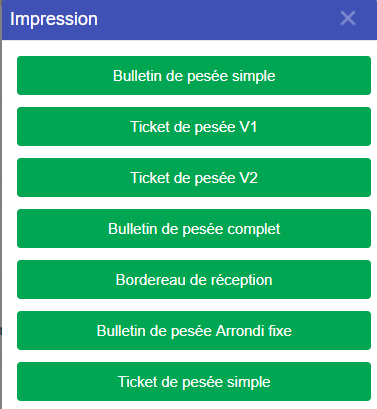

# Information de sortie

Cette fonctionnalité vous permet de consulter les informations sur le connaissement depuis l'entrée du camion au pont bascule jusqu'à sa sortie.

Sur de chaque document (ligne) les boutons à droite, vous permettent de **modifier**, ou **imprimer** le document.

### **Visualisation de la fiche : Information de Sortie**

Pour modifier un document (ligne), vous devez cliquez sur **modifier**.

Pour visualiser un document (ligne), vous devez cliquez sur l'icone de **recherche**.

Choisir un format de ticket ou de bulletin pour l'impression.

