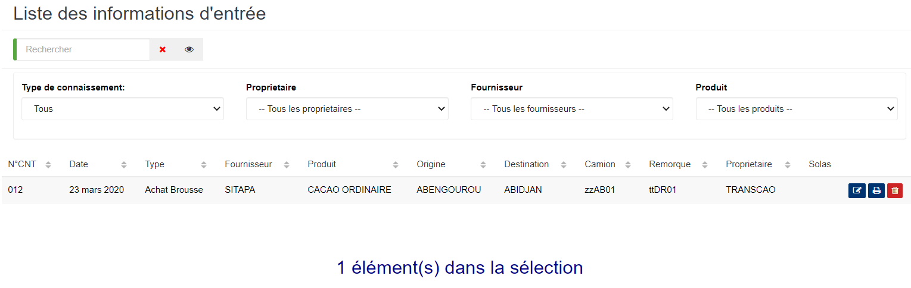
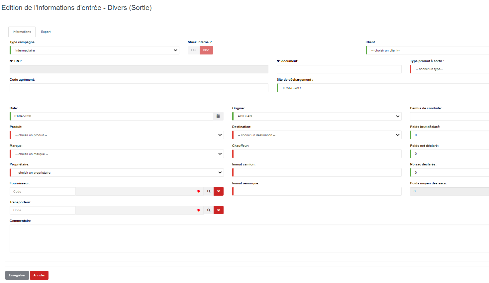
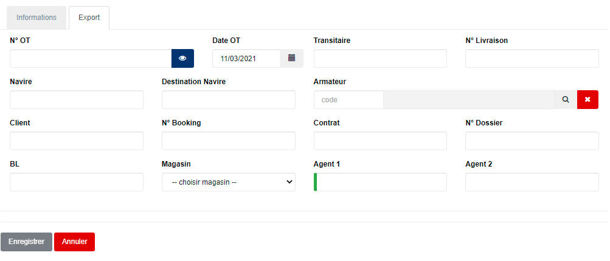

# Divers (Sortie)

Cette fonctionnalité vous permet de gérer les sorties de produit sans toute fois impacter obligatoirement le stock de l'usine.

### **Edition de la fiche : Divers (Sortie)**

L'écran d'édition se divise en deux parties. La première permet d'indiquer les informations du connaissement et la deuxième vous permet de définir les information exports.

**1ère partie : Onglet informations**

* **Type campagne** : indiquez le type de campagne.
* **Stock interne? :** Mettre "**oui"** si le mouvement impacte le stock.
* **Client :** indiquez le client.
* **Type produit à sortir** : indiquez le type de produit à faire sortir.
* **N° CNT** : indiquez le numéro du connaissement.
* **Type produit à sortir** : indiquez le type de produit à faire sortir de l'usine.
* **Date** : indiquez la date de saisie.
* **Produit** : indiquez le produit.
* **Marque** : indiquez la marque du produit.
* **Propriétaire** : indiquez le propriétaire du produit.
* **Fournisseur** : indiquez le fournisseur du produit.
* **Origine** : indiquez l'origine du produit.
* **Destination** : indiquez la destination du produit.
* **Chauffeur** : indiquez le nom du chauffeur.
* **Immat camion** : indiquez l'immatriculation du camion.
* **Immat remorque** : indiquez l'immatriculation de la remorque.

**2ème partie : Onglet Export**

* **N° OT**: indiquez le numéro de l'ordre de transit (OT).
* **Date OT:** indiquez la date de l'ordre de transit
* **Transitaire** : indiquez le transitaire.
* **N° Livraison** : indiquez le numéro de livraison.
* **Navire**: indiquez le navire.
* **Destination Navire** : indiquez le port de destination.
* **Armateur** : indiquez l'armateur .
* **Client**: indiquez le client.
* **N° Booking** : indiquez le numéro de booking .
* **Contrat** : indiquez le numéro de contrat.
* **N° Dossier** : indiquez le numéro de dossier.
* **BL** : indiquez le numéro du BL.
* **Magasin** : indiquez le magasin transitaire.
* **Agent 1** : indiquez le nom du 1er agent de la chambre de commerce.
* **Agent 2 :** indiquez le nom du 2ème agent de la chambre de commerce.

