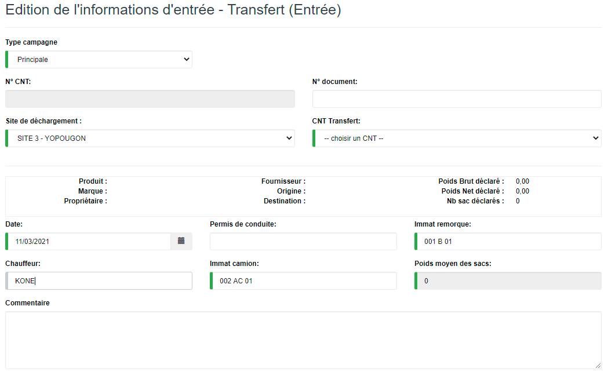
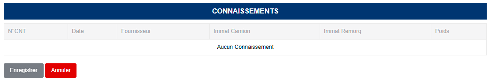

# Transfert (Entrée)

Cette fonctionnalité vous permet de gérer la réception des produits brousses provenant d'une usine tierce.

.PNG>)

### **Edition de la fiche : Transfert (Entrée)**

L'écran d'édition se divise en deux parties. La première permet d'indiquer les informations du connaissement et la deuxième vous permet de consulter la listes des différents connaissements à recevoir.

**1ère partie :**

* **Type campagne** : indiquez le type de campagne.
* **N° CNT** : indiquez le numéro du connaissement.
* **Site de déchargement** : indiquez le site de déchargement.
* **CNT Transfert** : indiquez le connaissement à transférer.
* **Chauffeur** : indiquez le nom du chauffeur.
* **Immat camion** : indiquez l'immatriculation du camion.
* **Immat remorque** : indiquez l'immatriculation de la remorque.

**2ère partie :**

Liste des connaissement à recevoir

