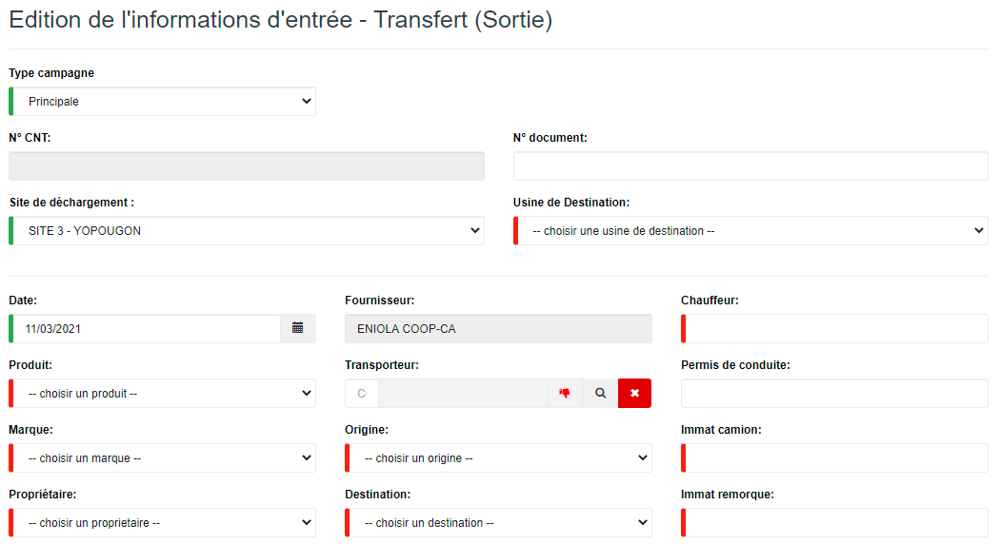
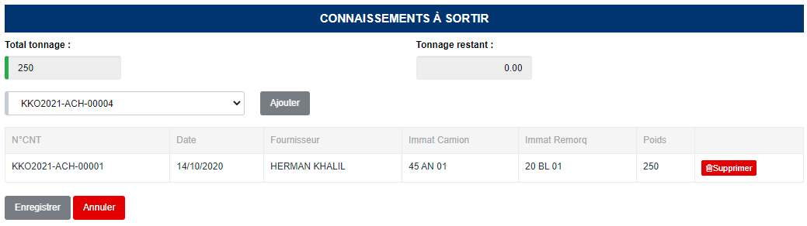

# Transfert (Sortie)

Cette fonctionnalité vous permet de gérer les transfert de produits brousses d'une usine à une autre.

.PNG>)

### **Edition de la fiche : Transfert (Sortie)**

L'écran d'édition se divise en deux parties. La première permet d'indiquer les informations du connaissement et la deuxième vous permet de définir les  poids des différents connaissements à transférer.

**1ère partie : Onglet Informations**

* **Type campagne** : indiquez le type de campagne.
* **N° CNT** : indiquez le numéro du connaissement.
* **Site de déchargement** : indiquez le site de déchargement.
* **Usine de destination** : indiquez l'usine de destination.
* **Date** : indiquez la date de saisie.
* **Produit** : indiquez le produit.
* **Marque** : indiquez la marque du produit.
* **Propriétaire** : indiquez le propriétaire du produit.
* **Origine** : indiquez l'origine du produit.
* **Destination** : indiquez la destination du produit.
* **Chauffeur** : indiquez le nom du chauffeur.
* **Immat camion** : indiquez l'immatriculation du camion.
* **Immat remorque** : indiquez l'immatriculation de la remorque.

**2ème partie : Onglet Export**

* **Total tonnage**: indiquez le poids.
* **Choisir un connaissement** : sélectionnez le connaissement.
* **Ajouter** : cliquez sur le bouton "Ajouter" pour ajouter une ligne.

