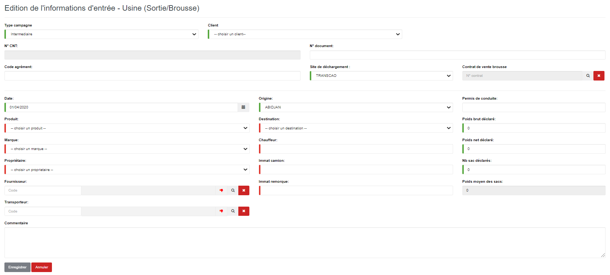

# Usine (Sortie/Brousse)

Cette fonctionnalité vous permet de gérer les sorties des produits brousses de l'usine.

.PNG>)

### **Edition de la fiche : Usine (Sortie/Brousse)**

* **Type campagne** : indiquez le type de campagne.
* **N° CNT** : indiquez le numéro du connaissement.
* **Date** : indiquez la date de saisie.
* **Produit** : indiquez le produit.
* **Marque** : indiquez la marque du produit.
* **Propriétaire** : indiquez le propriétaire du produit.
* **Fournisseur** : indiquez le fournisseur du produit.
* **Origine** : indiquez l'origine du produit.
* **Destination** : indiquez la destination du produit.
* **Chauffeur** : indiquez le nom du chauffeur.
* **Immat camion** : indiquez l'immatriculation du camion.
* **Immat remorque** : indiquez l'immatriculation de la remorque.

