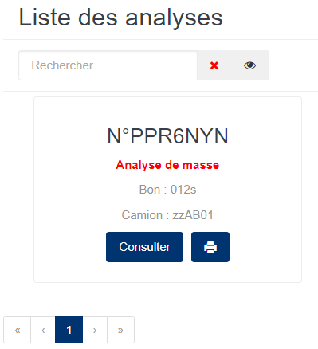
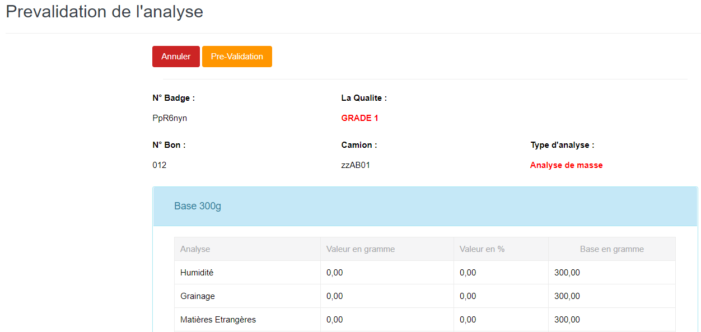

# Pre-Validation Analyse

Cette fonctionnalité vous permet de faire la validation des analyses de masse effectuées sur des échantillons des produits brousses.

### **Edition de la fiche : Pré-Validation Analyse**

Cliquez sur le bouton « **Pre-Validation** » de cet écran pour valider les analyses de masse.

