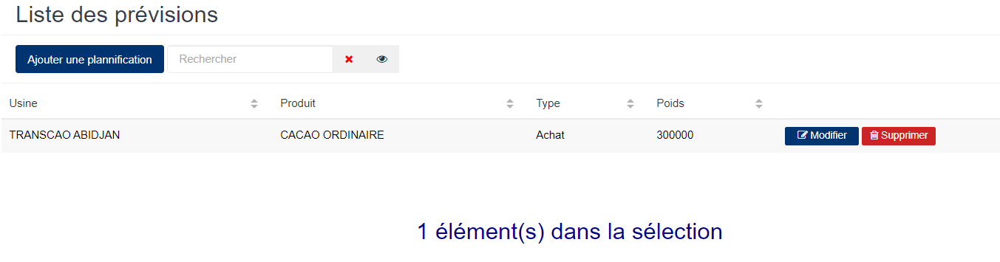
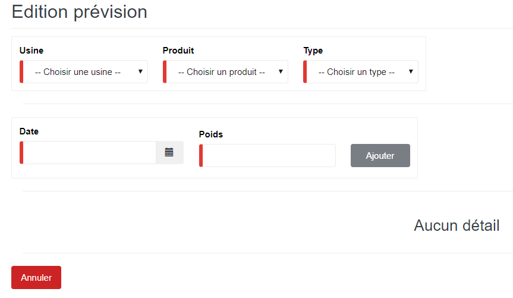

# Prévision

Cette fonctionnalité vous permet de planifier des prévisions de stock en achat, en usinage et en shipping.

## **Edition de la fiche : Prévision**

les zones ci-dessous de cet écran sont obligatoires.

* **Usine** : indiquez l'usine de stockage.
* **Produit** : indiquez le produit.
* **Type** : indiquez le type de stock.
* **Date** : indiquez la date de saisie.
* **Poids** : indiquez le poids.

