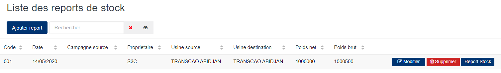
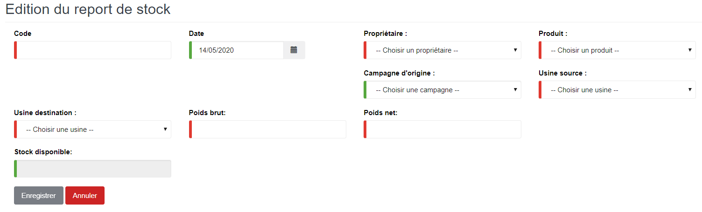

# Report Stock

Cette fonctionnalité vous permet de gérer les reports de stocks d'une campagne.

## **Edition de la fiche : Report Stocks**

les zones ci-dessous de cet écran sont obligatoires.

* **Code** : indiquez le code de l'opération.
* **Date** : indiquez la date de saisie.
* **Propriétaire** : indiquez le propriétaire.
* **Produit** : indiquez le produit.
* _\*Campagne d'origine_ : indiquez la campagne d'origine.
* **Usine source** : indiquez l'usine source.
* **Usine de destination** : indiquez l'usine de destination.
* **Poids brut** : indiquez le poids brut.
* **Poids Net** : indiquez le poids net.

