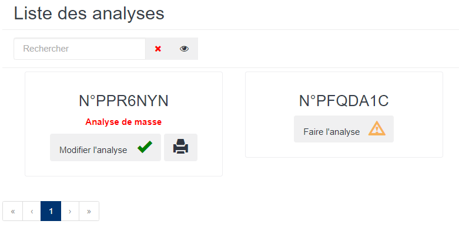
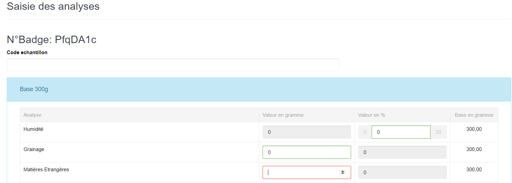

# Saisie Analyse

Cette fonctionnalité vous permet de faire la saisie des analyses effectuées sur des échantillons des produits brousses.

Les gadgets avec l'icone de couleur verte montrent que les analyses des échantillons sont déjà enregistrées.

### **Edition de la fiche : Saisie Analyse**

* **Valeur en gramme** : indiquez la valeur g.
* **Valeur en Pourcentage :** indiquez la valeur en %.

