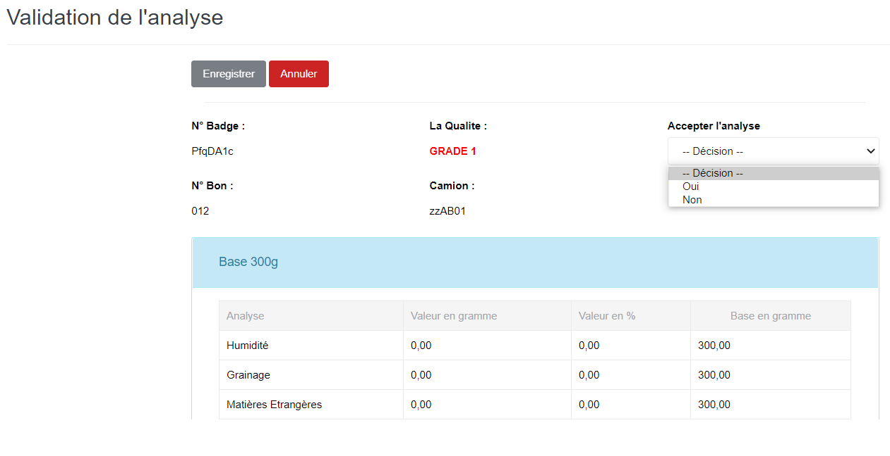

# Validation Analyse

Cette fonctionnalité vous permet de faire la validation des analyses normales effectuées sur des échantillons des produits brousses.

.PNG>)

### **Edition de la fiche : Validation Analyse**

* **Accepter l'analyse** : indiquez la décision "**Oui**" ou "**Non**"

