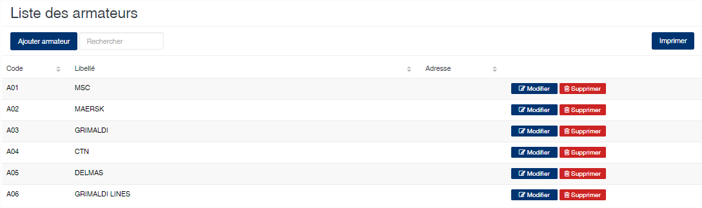
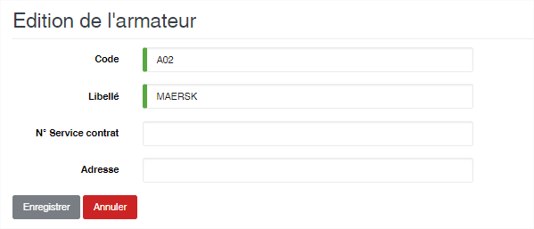

# Armateur

Cette option vous permet de gérer les armateurs.

### **Edition de la fiche : Armateur**

Toutes les zones de cet écran sont obligatoire.

* **Code** : indiquez le code de l’armateur.&#x20;
* **Libellé** : indiquez le libellé de l’armateur.&#x20;
* **N° service contrat** : indiquez le contrat de service de l’armateur.&#x20;
* **Adresse** : indiquez l’adresse de l’armateur.

