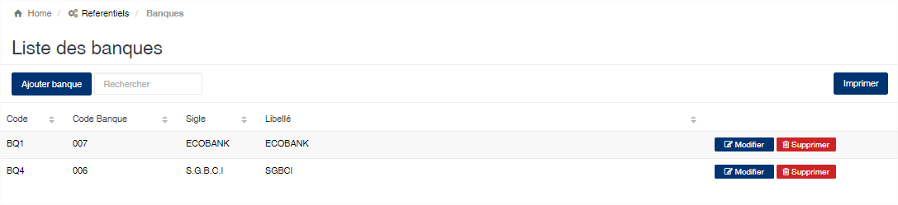
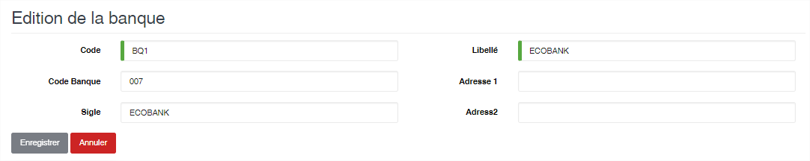

# Banque

Cette option vous permet d'enregistrer les banques.

### **Edition de la fiche : Banque**

* **Code** : indiquez le code de la banque. Ce code est unique dans l'application.&#x20;
* **Libellé** : indiquez la désignation de la banque.&#x20;
* **Code banque** : indiquez le code banque officiel.&#x20;
* **Sigle :** indiquez le sigle de la banque.
* **Adresse 1 et 2** : indiquez l’adresse de la banque.

##
