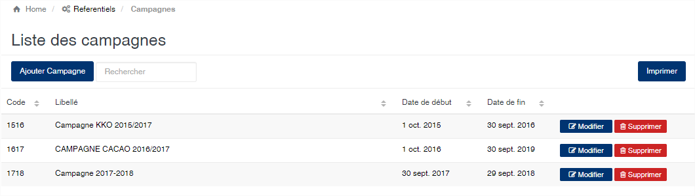
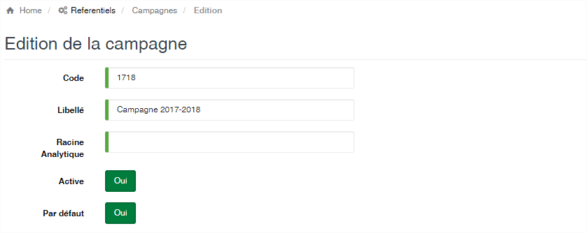
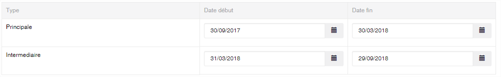
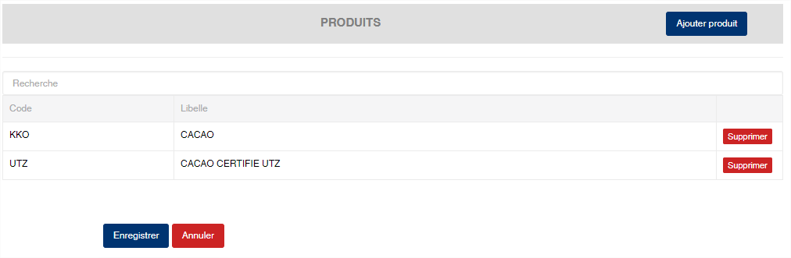

# Campagne

Cette option vous permet de gérer les campagnes à utiliser dans SIGAM. La campagne représente au sein de l'application les périodes de SIGAM vous permet de définir différentes campagnes en fonction des produits manipulés par l'application.

### **Edition de la fiche : Campagne**

L'écran d'édition des campagnes se divise en trois parties.

**1ère partie** : Elle vous permet d'indiquer le code et la désignation de la campagne.

* En fonction de votre schémas de comptabilisation des écritures, vous pourriez avoir la nécessité d'indiquer la racine analytique de la campagne.
* Le bouton **Active (oui/non)** vous permet d'activer ou de désactiver une campagne. Lorsqu'une campagne est désactivée, vous ne pouvez pas vous connecter à cette campagne au niveau de l'écran de connexion et donc d'avoir accès aux données de cette campagne.
* Le bouton **Par défaut (oui/non)** vous permet de définir quelle est la campagne par défaut.  La campagne défaut est celle qui est automatiquement sélectionnée dans l'écran de connexion à SIGAM. Si aucune campagne n'est définie comme par défaut, alors SIGAM sélectionne la première campagne dans l'ordre alphabétique des désignations.

**2ème partie** : Cette zone vous permet de définir les dates correspondantes aux périodes de la campagne.

**Attention** : Les dates de début et de fin sont très importantes. SIGAM n’autorisera pas d’opérations (achats, règlements, etc.) dont les dates sont en dehors de la période de la campagne. La période de la campagne est automatiquement déterminée et correspond à la date de début de la période **Principale** et la date de fin de la période **Intermédiaire**.

**3ème partie** : Cette zone vous permet de définir les produits à utiliser sur la campagne. Si aucun produit n'est précisé dans cette partie alors SIGAM autorisera l'utilisation de n'importe quelle produit sur la campagne. Si des produits sont définis comme sur l'écran ci-dessous alors seuls ces derniers pourront faire l'objet d'un traitement sur la campagne.

A la fin de votre saisie, afin de valider vos modifications, n'oubliez pas de cliquer sur le bouton **Enregistrer**

