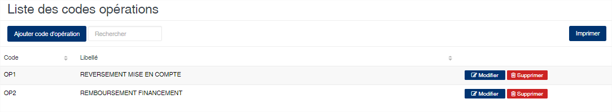
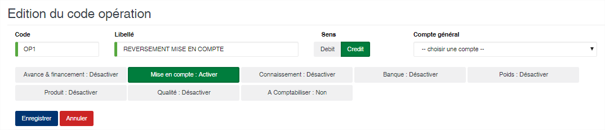

# Code Opération

Cette option permet de définir les différentes opérations à utiliser pour passer des écritures sur les comptes des fournisseurs.

### **Edition de la fiche : Code opération**

* **Code** : Indiquez le code de l’opération. Ce code est unique dans l’application.
* **Libellé** : Indiquez la désignation de l’opération.
* **Sens** : Sélectionnez le sens de l’opération (Débit ou Crédit).
* **Compte général** : Indiquez le numéro de compte général associé à l’opération. Cela sera utilisé pour la comptabilisation (pour l’instant cette information n’est pas utilisée dans la comptabilisation).
* **Type opération** : Non utilisé pour l’instant.
* **Avance & financement** : Activée, elle indique qu’au moment de la saisie des opérations vous devez indiquer le montant prêté.
* **Mise en compte** : Activée, indique que cette opération sera lié aux opérations de mise en compte sur les financements. Elle vous permet par exemple de pouvoir saisir les OD de reversement des mise en compte prélevées.
* **Connaissement** : Activée, elle indique que le numéro de connaissement devra obligatoirement être indiqué au moment de la saisie des opérations.
* **Banque** : Activée, elle indique que la banque doit obligatoirement être indiquée au moment de la saisie des opérations.
* **Poids** : Activée, elle indique que le poids devra obligatoirement être indiqué au moment de la saisie des opérations.
* **Produit** : Activée, elle indique que le produit doit être indiqué au moment de la saisie des opérations.
* **Qualité** : Activée, elle indique que la qualité du produit doit obligatoirement être indiquée au moment de la saisie des opérations.
* **A Comptabiliser** : Activée, elle indique que ces opérations devront figurer dans les écritures de déversement en comptabilité.

