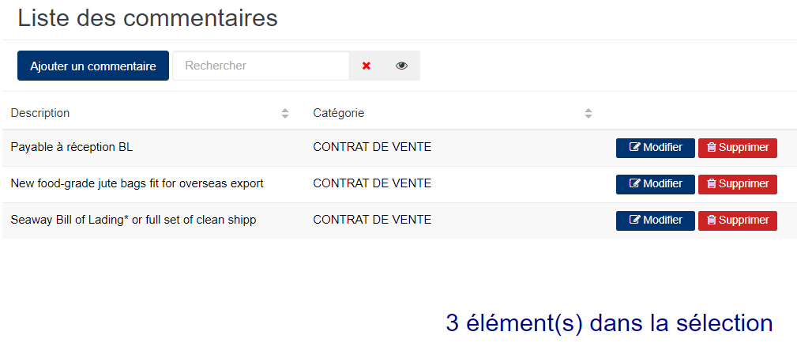
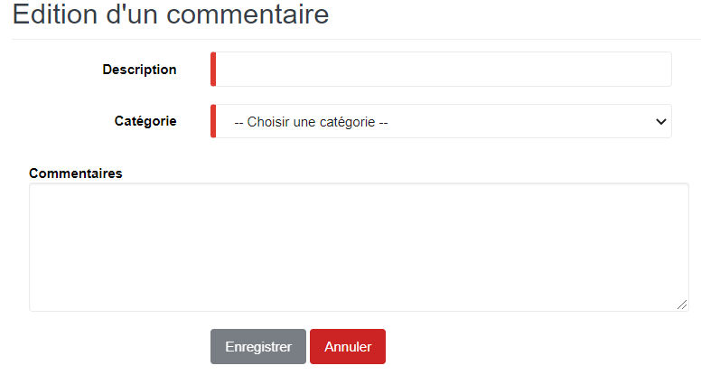

# Commentaires

Cette option permet de définir les commentaires à afficher sur les différentes catégories de documents au niveau du shipping

### **Edition de la fiche : Armateur**

Les zones ci-dessous de cet écran sont obligatoires.

* **Description** : Indiquez le commentaire du document.
* **Catégorie** : Indiquez la catégorie de document sur lequel sera affichée le commentaire .

Les autres zones facultatives sont les suivantes.

* **Commentaires** : Indiquez le commentaire .

