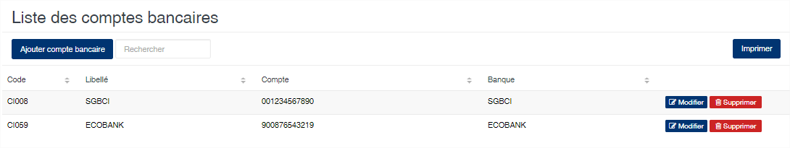
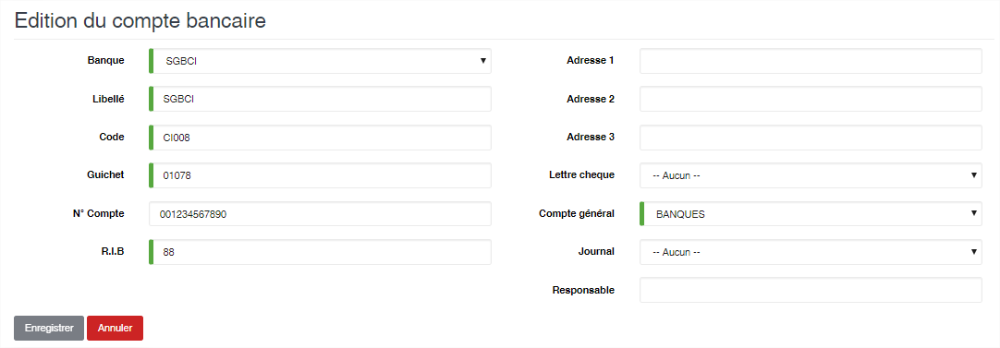

# Compte Bancaire

Cette option permet l’enregistrement des différents comptes bancaires de l’entreprise.

### **Edition de la fiche : Compte Bancaire**

* **Banque** : Sélectionnez la banque.
* **Libellé** : Indiquez un libellé pour le compte.
* **Code** : Indiquez le numéro de code bancaire.
* **Guichet** : Indiquez numéro de guichet.
* **Compte** : Indiquez le numéro de compte.
* **RIB** : Indiquez le numéro de RIB.
* **Adresse 1,2 et 3** : Indiquez l’adresse de domiciliation du compte.
* **Lettre chèque** : Sélectionnez la lettre chèque à associer à ce compte.
* **Compte général** : Indiquez le compte général de trésorerie associé à ce compte bancaire. Ce compte sera utilisé lors de la comptabilisation des règlements.
* **Journal** : Indiquez le journal de trésorerie associé à ce compte bancaire. Ce journal sera utilisé lors de la comptabilisation.

