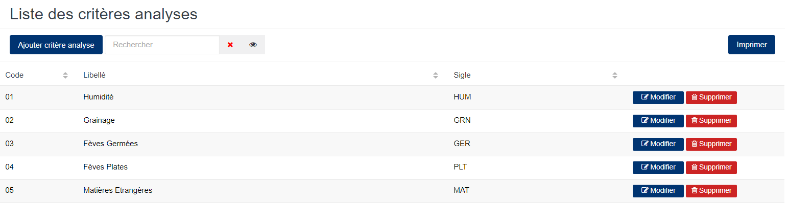
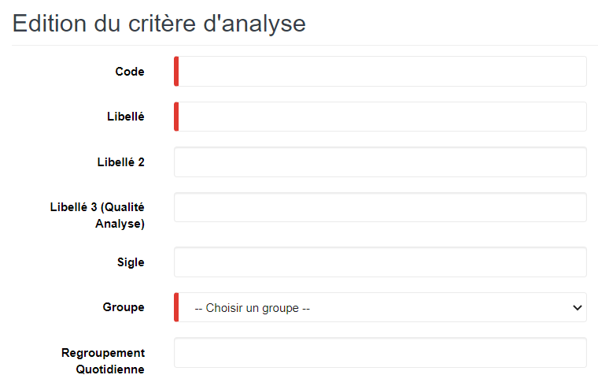
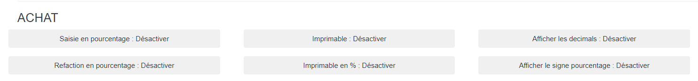
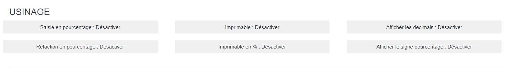
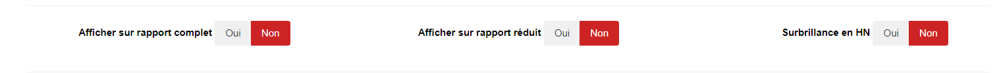

# Critère d'Analyse

Cette option permet de déclarer les critères qui seront mesurés lors de l'analyse des échantillons des produits.

### **Edition de la fiche : Critère d'Analyse**

L'écran d'édition de critère d'analyse se divise en quatre parties.

**1ère partie** : Elle vous permet d'indiquer les informations élémentaires sur le critère d'analyse.

les zones ci-dessous de cet écran sont obligatoires.

* **Code** : Indiquez le code.
* **Libellé** : Indiquez le libellé.
* **Groupe** : Indiquez le groupe (cela permet de faire des regroupements).

les autres zones facultatives sont les suivantes.

* **Libellé 2** : Indiquez le deuxième libellé .
* **Libellé 3** : Indiquez le troisième libellé.
* **Sigle** : Indiquez le sigle (cela permet de raccourcis les libellés de certains critères d'analyse).
* **Regroupement quotidien** : indiquez le regroupement quotidien.

**2ème partie - Achat** : Elle vous permet d'indiquer le format de la valeur du critère d'analyse et son mode d'affichage sur les rapports.

* **Saisie en pourcentage** : Activée, elle indique que la valeur de ce critère d'analyse sera saisie en pourcentage.
* **Imprimable** : Activée, elle indique que ce critère d'analyse sera visible sur les rapports.
* **Afficher les décimaux** : Activée, elle indique que la valeur de ce critère d'analyse sera affichée en nombre à virgule sur les rapports.
* **Réfaction en pourcentage** : Activée, elle indique que la réfaction qui est issu du calcul des valeurs d'analyse sera évaluée en pourcentage.
* **Imprimable en %** : Activée, elle indique que ce critère d'analyse sera visible sous la forme de pourcentage sur les rapports.
* **Afficher le signe pourcentage** : Activée, elle indique que la valeur de ce critère d'analyse sera affichée suivi du signe % sur les rapports.

**3ème partie - Usinage**: Elle vous permet d'indiquer le format de la valeur du critère d'analyse et son mode d'affichage sur les rapports.

* **Saisie en pourcentage** : Activée, elle indique que la valeur de ce critère d'analyse sera saisie en pourcentage.
* **Imprimable** : Activée, elle indique que ce critère d'analyse sera visible sur les rapports.
* **Afficher les décimaux** : Activée, elle indique que la valeur de ce critère d'analyse sera affichée en nombre à virgule sur les rapports.
* **Réfaction en pourcentage** : Activée, elle indique que la réfaction qui est issu du calcul des valeurs d'analyse sera évaluée en pourcentage.
* **Imprimable en %** : Activée, elle indique que ce critère d'analyse sera visible sous la forme de pourcentage sur les rapports.
* **Afficher le signe pourcentage** : Activée, elle indique que la valeur de ce critère d'analyse sera affichée suivi du signe % sur les rapports.

**4ème partie**: Elle vous permet d'indiquer l'affichage des critères sur des rapports spécifiques.

* **Afficher sur rapport complet** : Oui, elle indique que la valeur de ce critère d'analyse s'affiche sur un rapport complet.
* **Afficher sur rapport réduit** :  Oui, elle indique que la valeur de ce critère d'analyse s'affiche sur un rapport réduit.
* **Surbrillance en HN** : Oui, elle indique que la valeur de ce critère d'analyse sera affichée en fond gras.

|   |   |
| - | - |
|   |   |

