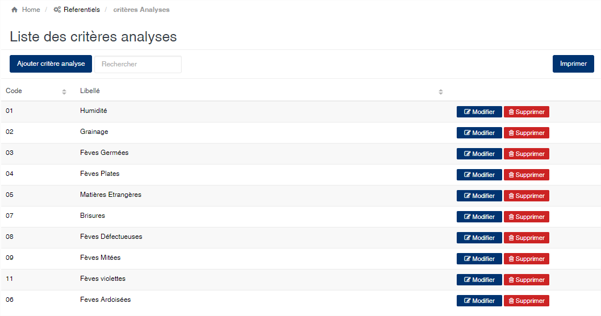
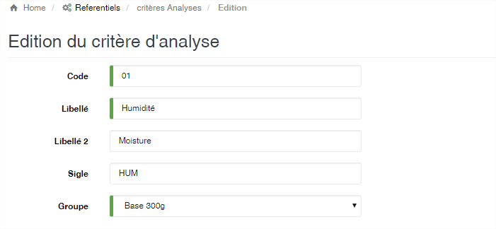
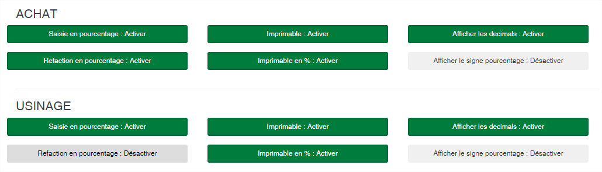

# Critères d'analyse

Cette option vous permet d’enregistrer les différents critères de détermination de l’analyse qualité des produits.

### **Edition de la fiche : Critère d'analyse**

L'écran d'édition se divise en deux parties. La première permet d'indiquer les informations signalétiques de l'analyse et la deuxième vous permet de définir le paramétrage de la saisie et l'impression des analyses.

* **Code** : indiquez le code du critère d’analyse. Ce code est unique dans l’application.
* **Libellé** : indiquez la désignation principale du critère d’analyse.
* **Libellé 2** : indiquez la désignation secondaire et optionnelle du critère d’analyse. Cette deuxième désignation vous permet par exemple de donner le nom de l’analyse dans une autre langue ou un nouveau sigle.
* **Sigle** : indiquez le sigle de l'analyse. Cette zone est optionnelle. Le sigle permet de reconnaître l'analyse sous un format court qui est utilisé notamment dans les éditions des analyses.
* **Groupe** : indiquez le groupe permettant le regroupement de l’analyse.

La deuxième partie de l'écran est composée de bouton à bascule (oui/non) qui permettent d'activer ou de désactiver des options. Ces options permettent la configuration du comportement de l'analyse lors de la saisie et de l'impression. Vous définissez ce comportement lors de la saisie des analyses dans le module des achats et/ou dans le module d'usinage des lots.

* **Saisie en pourcentage** : Activé, ce bouton indique que les valeurs d’analyses seront en pourcentage. Désactivé, les valeurs d’analyses seront en nombre (graine, poids, etc.).&#x20;
* **Réfaction en pourcentage** : Activé, ce bouton indique que le calcul de la réfaction se fera sur les valeurs en pourcentage. Désactivé, le calcul de la réfaction se fera sur les valeurs en nombre.&#x20;
* **Imprimable** : Activé, ce bouton indique que l’analyse sera imprimé sur les documents (bulletin de pesée, bordereau de réception de produit, etc.).&#x20;
* **Imprimable en %** : Activé, ce bouton indique que lorsque l’analyse est imprimable c’est la valeur en pourcentage qui doit être affichée. Désactivé, c’est la valeur en nombre qui sera affichée.&#x20;
* **Afficher les décimales** : Activé, ce bouton indique que le nombre à imprimé contiendra deux décimales. Désactivé, seule la partie entière sera imprimée.&#x20;
* **Afficher le signe pourcentage** : Activé, ce bouton indique que le symbole ‘%’ sera imprimé à gauche de la valeur de l’analyse. Désactivé le symbole ne sera pas imprimé.
